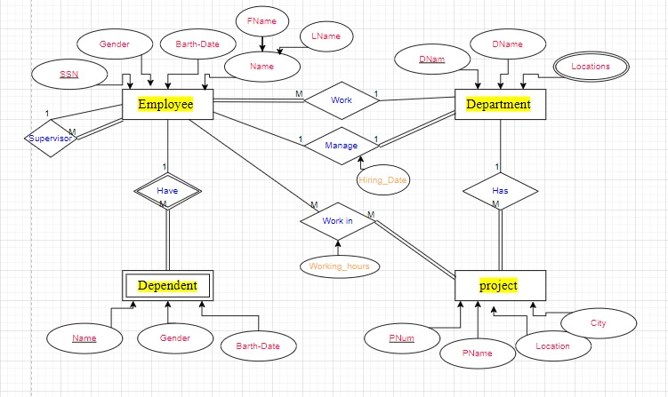

# Company Database E-R Diagram

## Description

A big company has decided to store information about its projects and employees in a database. The company has wisely chosen to hire you as a database designer. Prepare an E-R diagram for this Company according to the following description:

- The company has a number of employees; each employee has SSN, Birth Date, Gender, and Name, which are represented as Fname and Lname.
- The company has a set of departments; each department has a set of attributes: DName, DNUM (unique), and locations.
- Employees work in several projects; each project has Pname, PNumber as an identifier, Location, and City.
- Each employee may have a set of dependents; each dependent has a Dependent Name (unique), Gender, and Birth Date.
  - Note: if the employee leaves the company, there is no need to store their dependents' info.
- For each Department, there is always one employee assigned to manage that Department, and each manager has a hiring date.
- A Department may have employees, but an employee must work in only one department.
- Each department may have a set of projects, and each project must be assigned to one department.
- Employees work in several projects, and each project has several employees. Each employee has a number of working hours in each project.
- Each employee has a supervisor.

### Entities and Attributes

1. **Employee**
   - Attributes: SSN, Birth Date, Gender, Name (Fname, Lname)     - SSN
    
2. **Department**
   - Attributes: DName, DNUM (unique), Locations

3. **Project**
   - Attributes: Name (unique), Gender, Birth Date

4. **Dependent**
   - Attributes: Name (unique), Gender, Birth Date

### Relationships

- **Employee Work in Department**: (M:1) 
  - Mandatory on the Employee side, Optional on the Department side
- **Employee Manage Department**: (1:1) 
  - Optional on the Employee side, Mandatory on the Department side
- **Employee Work in Projects**: (M:M) 
  - Optional on the Employee side, Optional on the Project side
- **Employee Have Dependents**: (1:M) 
  - Optional on the Employee side, Mandatory on the Dependent side
- **Employee Has Supervisor**: (M:1) 
  - Optional on the Employee side, Optional on the Supervisor side
- **Department Has Projects**: (1:M)

### Constraints and Notes

- Each employee may have dependents, but if the employee leaves the company, there is no need to store the dependents' information.
- For each department, there is always one employee assigned to manage that department, and each manager has a hiring date.
- An employee must work in only one department, but a department may have multiple employees.
- Each project is assigned to one department, but a department may have multiple projects.
- Each employee can work on several projects, and each project can have several employees. Each employee has a number of working hours in each project.
- Each employee has a supervisor.

### E-R Diagram

The Diagram shows:
- Entities with their attributes
- Relationships between entities
- Cardinality and participation between entities
