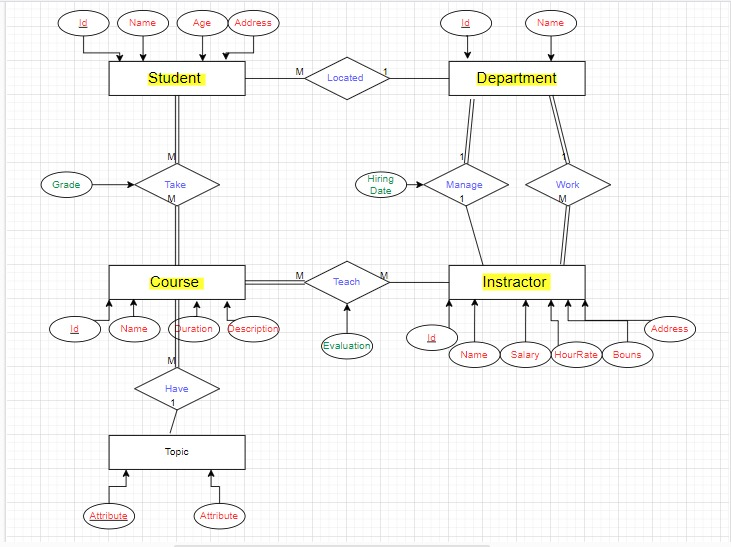

# ITI Database E-R Diagram

## Description

ITI has decided to store information about its Students and curriculums in a database. ITI has wisely chosen to hire you as a database designer. Prepare an E-R diagram for ITI that describes its activities according to the following description:

- ITI has a number of students in different departments (tracks); each student has St_id (unique), studentName (Fname, Lname), St_age, and st_address.
- Each department has dept_id (unique) and dep_name.
- Students take many courses; each course has crs_id, crs_name, crs_duration, and crs_Description.
- Students have a grade in each course.
- Each department contains a set of instructors, and each instructor is located in one department. Each instructor has ins_id, ins_name, ins_salary, ins_hourRate, ins_bouns, and ins_address.
- For each Department, there is always one instructor assigned to manage that Department, and each manager has a hiring date.
- Instructors may teach many courses, and each course may be conducted by many instructors. Each instructor has an evaluation in each course.
- A course is classified under one topic; each topic may have many courses, and each topic has top_name and top_id.

## Entities and Attributes

1. **Student**
   - Attributes: St_id, (unique)Name, (Fname, Lname), St_age, St_address

2. **Department**
   - Attributes: dept_id(unique), dep_name

3. **Course**
   - Attributes: crs_id, crs_name, crs_duration, crs_Description

4. **Instructor**
   - Attributes: ins_id, ins_name, ins_salary, ins_hourRate, ins_bouns, ins_address

5. **Topic**
   - Attributes: top_id, top_name

## Relationships

- **Student Located in Department**: (M:1)
  - Optional on the Student side, Optional on the Department side

- **Student Takes Course**: (M:M)
  - Mandatory on the Course side, Mandatory on the Student side

- **Instructor Works in Department**: (M:1)
  - Mandatory on the Instructor side, Mandatory on the Department side

- **Instructor Manages Department**: (1:1)
  - Mandatory on the Department side, Optional on the Instructor side

- **Instructor Teaches Course**: (M:M)
  - Mandatory on the Course side, Optional on the Instructor side

- **Topic Has Course**: (1:M)
  - Mandatory on the Course side, Optional on the Topic side

## Constraints and Notes

- Each student may be located in one department, but the relationship is optional.
- Students must take courses, and courses must have students.
- Instructors must work in one department, and each department must have instructors.
- Each department is managed by one instructor, and the relationship is optional on the department side.
- Instructors may teach multiple courses, and each course can have multiple instructors.
- Courses are classified under topics, and each topic can have multiple courses.

## E-R Diagram

The diagram shows:
- Entities with their attributes
- Relationships between entities
- Cardinality and participation between entities

