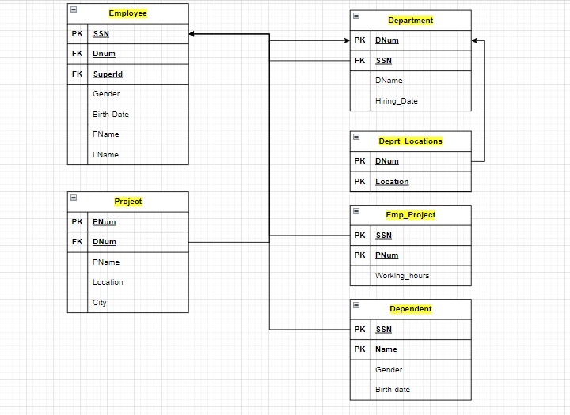
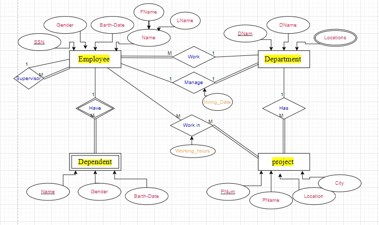

# Database Schema Mapping Documentation

## Relational Schema Mapping

### Tables and ERD Explanation

#### 1. Employee
- **Table Name**: `Employee`
- **Primary Key (PK)**: `SSN`
- **Foreign Keys (FK)**: 
  - `Dnum` (References `Department.DNum`)
  - `Superid` (References `Employee.SSN`)
- **Attributes**: 
  - `Gender`
  - `Birth-Date`
  - `FName`
  - `LName`
- **ERD Explanation**: 
  - The `Employee` table represents the `Employee` entity in the ERD.
  - The `SSN` is the unique identifier for each employee.
  - `Dnum` links an employee to the department they work in.
  - `Superid` references the employee's supervisor, establishing a self-referencing relationship.

#### 2. Department
- **Table Name**: `Department`
- **Primary Key (PK)**: `DNum`
- **Foreign Key (FK)**: `SSN` (References `Employee.SSN`)
- **Attributes**:
  - `DName`
  - `Hiring_Date`
- **ERD Explanation**: 
  - The `Department` table represents the `Department` entity in the ERD.
  - The `DNum` is the unique identifier for each department.
  - `SSN` references the employee who manages the department.

#### 3. Dept_Locations
- **Table Name**: `Dept_Locations`
- **Primary Key (PK)**: Composite key of `DNum` and `Location`
- **Attributes**: None
- **ERD Explanation**: 
  - This table represents the multi-valued attribute `Locations` of the `Department` entity in the ERD.
  - Each department can have multiple locations, captured by the composite primary key.

#### 4. Project
- **Table Name**: `Project`
- **Primary Key (PK)**: `PNum`
- **Foreign Key (FK)**: `DNum` (References `Department.DNum`)
- **Attributes**:
  - `PName`
  - `Location`
  - `City`
- **ERD Explanation**: 
  - The `Project` table represents the `Project` entity in the ERD.
  - The `PNum` is the unique identifier for each project.
  - `DNum` links a project to the department it belongs to.

#### 5. Emp_Project
- **Table Name**: `Emp_Project`
- **Primary Key (PK)**: Composite key of `SSN` and `PNum`
- **Attributes**: `Working_hours`
- **ERD Explanation**: 
  - This table represents the many-to-many relationship `Works On` between `Employee` and `Project` entities in the ERD.
  - `SSN` references an employee, and `PNum` references a project.
  - `Working_hours` indicates the number of hours an employee works on a project.

#### 6. Dependent
- **Table Name**: `Dependent`
- **Primary Key (PK)**: `SSN` (References `Employee.SSN`)
- **Attributes**:
  - `Name`
  - `Gender`
  - `Birth-Date`
- **ERD Explanation**: 
  - The `Dependent` table represents the `Dependent` entity in the ERD.
  - Each dependent is associated with an employee, identified by `SSN`.

### Conclusion
The mapping diagram converts the conceptual ERD into a logical relational schema, capturing all entities, attributes, and relationships accurately.

