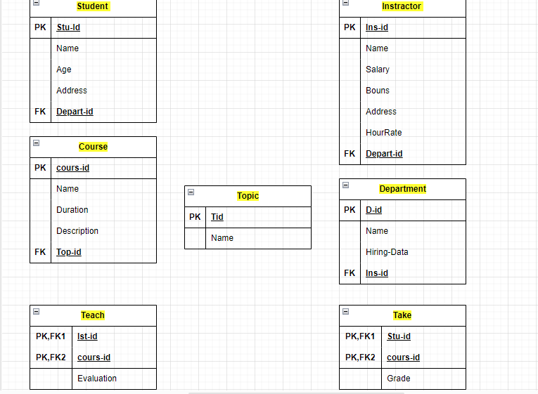
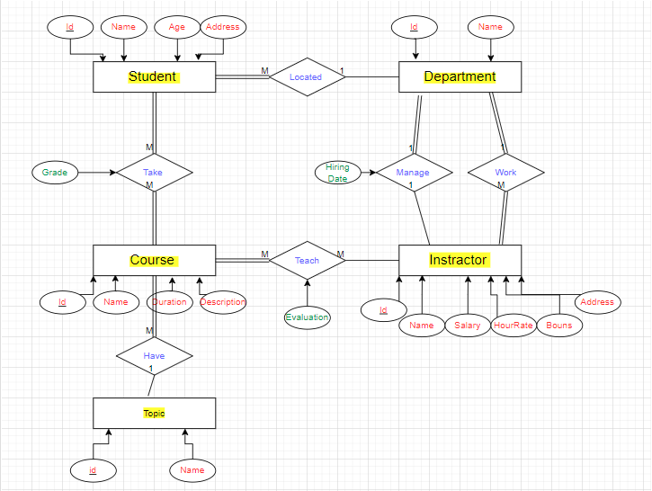

# Database Schema Mapping Documentation

## Relational Schema Mapping

### Tables and ERD Explanation

#### 1. Student
- **Table Name**: `Student`
- **Primary Key (PK)**: `Stu_Id`
- **Foreign Key (FK)**: `Depart_id` (References `Department.D_id`)
- **Attributes**:
  - `Name`
  - `Age`
  - `Address`
- **ERD Explanation**:
  - The `Student` table represents the `Student` entity in the ERD.
  - The `Stu_Id` is the unique identifier for each student.
  - `Depart_id` links a student to the department they belong to.

#### 2. Course
- **Table Name**: `Course`
- **Primary Key (PK)**: `cours_id`
- **Foreign Key (FK)**: `Top_id` (References `Topic.Tid`)
- **Attributes**:
  - `Name`
  - `Duration`
  - `Description`
- **ERD Explanation**:
  - The `Course` table represents the `Course` entity in the ERD.
  - The `cours_id` is the unique identifier for each course.
  - `Top_id` links a course to the topic it covers.

#### 3. Topic
- **Table Name**: `Topic`
- **Primary Key (PK)**: `Tid`
- **Attributes**:
  - `Name`
- **ERD Explanation**:
  - The `Topic` table represents the `Topic` entity in the ERD.
  - The `Tid` is the unique identifier for each topic.

#### 4. Instructor
- **Table Name**: `Instructor`
- **Primary Key (PK)**: `Ins_id`
- **Foreign Key (FK)**: `Depart_id` (References `Department.D_id`)
- **Attributes**:
  - `Name`
  - `Salary`
  - `Bouns`
  - `Address`
  - `HourRate`
- **ERD Explanation**:
  - The `Instructor` table represents the `Instructor` entity in the ERD.
  - The `Ins_id` is the unique identifier for each instructor.
  - `Depart_id` links an instructor to the department they belong to.

#### 5. Department
- **Table Name**: `Department`
- **Primary Key (PK)**: `D_id`
- **Foreign Key (FK)**: `Ins_id` (References `Instructor.Ins_id`)
- **Attributes**:
  - `Name`
  - `Hiring_Date`
- **ERD Explanation**:
  - The `Department` table represents the `Department` entity in the ERD.
  - The `D_id` is the unique identifier for each department.
  - `Ins_id` references the instructor who manages the department.

#### 6. Teach
- **Table Name**: `Teach`
- **Primary Key (PK)**: Composite key of `Ins_id` and `cours_id`
- **Attributes**:
  - `Evaluation`
- **ERD Explanation**:
  - This table represents the many-to-many relationship `Teach` between `Instructor` and `Course` entities in the ERD.
  - `Ins_id` references an instructor, and `cours_id` references a course.
  - `Evaluation` indicates the evaluation of the teaching process.

#### 7. Take
- **Table Name**: `Take`
- **Primary Key (PK)**: Composite key of `Stu_id` and `cours_id`
- **Attributes**:
  - `Grade`
- **ERD Explanation**:
  - This table represents the many-to-many relationship `Take` between `Student` and `Course` entities in the ERD.
  - `Stu_id` references a student, and `cours_id` references a course.
  - `Grade` indicates the student's grade in the course.

## Entity-Relationship Diagram (ERD)

### Conclusion
The mapping diagram converts the conceptual ERD into a logical relational schema, capturing all entities, attributes, and relationships accurately.

