# Content :- *DB Engine_ SQL Services_ Ranking Function_ Transact SQL*

## First Note 

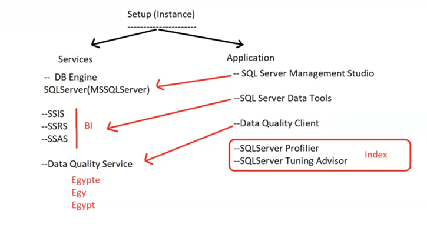

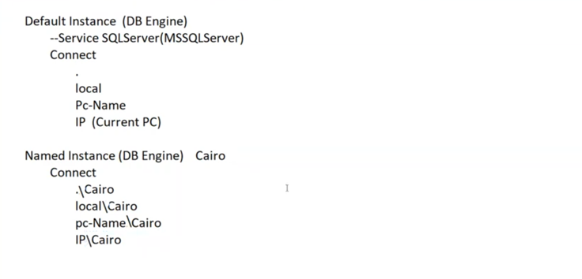

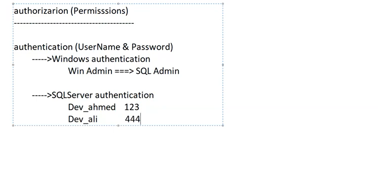


## Quire

- Top (2) --> First 2 Row 
- Top (3) with ties  

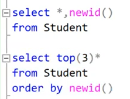
- NewId () --> Random ID Unique 

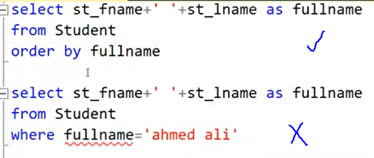	
- Execution Order :- From - join - on - where - group - having - select - order by - top 

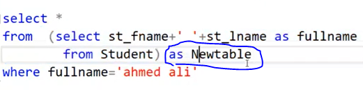
- Sub Quire with From ==> use As

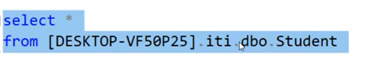
- DB Objects :- Table - View - Function - Rule - Constraint *ServerName.DBName.SchemaName.ObjectName*

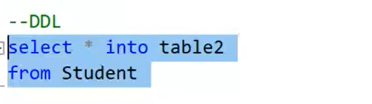
- Select .. Into (DDL) :- Create New Table 

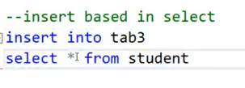
- Insert Based Select 

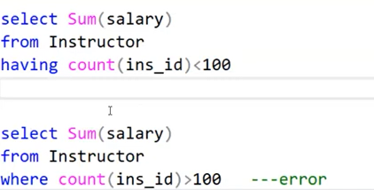
- Select with only Agg_Function 

## Ranking Function 

- **Row_Number()**
- **Dense_Reank()**
- **NTiles( Group )**
- **Rank()**

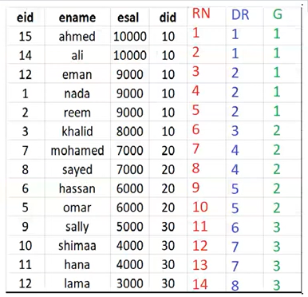
### Second highest salary Without repetition *Row_Number()*
```sql
Select * From (
	Select *, Row_Number() over(order by esal desc) as RN
	From Employee
	) As NewTable 
Where RN = 2;	
```

#### Expected Output
```OUTPUT
| EmpID | EmpName | esal  | RN |
|-------|---------|-------|----|
|   14  |  ali    | 10000 |  2 |
```

### Second highest salary With repetition *Dense_Reank()*
```sql
Select * From (
	Select *, Dense_Rank() over(order by esal desc) as DR
	From Employee
	) As NewTable 
Where DR = 2;	
```

#### Expected Output
```OUTPUT
| EmpID | EmpName | esal  | DR |
|-------|---------|-------|----|
|   14  |  Eman   | 90000 | 2  |
|-------|---------|-------|----|
|   1   |  Nada   | 90000 | 2  |
|-------|---------|-------|----|
|   2   |  Reem   | 90000 | 2  |
```

### Divide into groups  *NTiles( Group )* 
```sql
Select * From (
	Select *,  NTiles(3) over(order by esal desc) as G
	From Employee
	) As NewTable 
Where G = 2;	
```

#### Expected Output
```OUTPUT
| EmpID | EmpName | esal  | RN |
|-------|---------|-------|----|
```


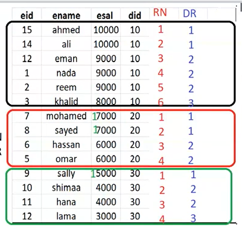
### Second highest salary in each department without repetition
```sql
Select * From (
	Select *, Row_Number() over(Partition by did order by esal desc) as RN
	From Employee
	) As NewTable 
Where RN = 2;	
```

### Second highest salary in each department with repetition
```sql
Select * From (
	Select *, Dense_Rank() over(Partition by did order by esal desc) as DR
	From Employee
	) As NewTable 
Where DR = 2;	
```


## Data Types 

In SQL Server (T-SQL), the data types define the type of data that can be stored in each column of a table. Below is a list of common data types used in T-SQL along with their sizes and brief descriptions.

### Numeric Data Types

| Data Type        | Size         | Description                                                                                                   |
| ---------------- | ------------ | ------------------------------------------------------------------------------------------------------------- |
| **TINYINT**      | 1 byte       | Unsigned integer with a range from 0 to 255.                                                                  |
| **SMALLINT**     | 2 bytes      | Integer with a range from -32,768 to 32,767.                                                                  |
| **INT**          | 4 bytes      | Integer with a range from -2,147,483,648 to 2,147,483,647.                                                    |
| **BIGINT**       | 8 bytes      | Integer with a range from -9,223,372,036,854,775,808 to 9,223,372,036,854,775,807.                            |
| **DECIMAL(p,s)** | Varies       | Fixed precision and scale numeric data. p is the precision (max 38), s is the scale.                          |
| **NUMERIC(p,s)** | Varies       | Synonym for DECIMAL.                                                                                          |
| **FLOAT(n)**     | 4 or 8 bytes | Floating-point number. n specifies the number of bits for precision. 4 bytes for n <= 24, 8 bytes for n > 24. |
| **REAL**         | 4 bytes      | Floating-point number with less precision than FLOAT.                                                         |
| **BIT**          | 1 byte       | Integer data type that can take a value of 1, 0, or NULL.                                                     |

### Character String Data Types

| Data Type       | Size                     | Description                                                                                      |
| --------------- | ------------------------ | ------------------------------------------------------------------------------------------------ |
| **CHAR(n)**     | n bytes                  | Fixed-length non-Unicode string data, where n is the string length. Pads with spaces if shorter. |
| **VARCHAR(n)**  | Varies (up to n bytes)   | Variable-length non-Unicode string data, where n is the string length.                           |
| **TEXT**        | Varies (up to 2GB)       | Variable-length non-Unicode string data up to 2GB. **Deprecated**; use VARCHAR(MAX) instead.     |
| **NCHAR(n)**    | n*2 bytes                | Fixed-length Unicode string data. Similar to CHAR but stores Unicode characters.                 |
| **NVARCHAR(n)** | Varies (up to n*2 bytes) | Variable-length Unicode string data. Similar to VARCHAR but stores Unicode characters.           |
| **NTEXT**       | Varies (up to 2GB)       | Variable-length Unicode string data up to 2GB. **Deprecated**; use NVARCHAR(MAX) instead.        |

### Binary Data Types

| Data Type        | Size                   | Description                                                                                   |
| ---------------- | ---------------------- | --------------------------------------------------------------------------------------------- |
| **BINARY(n)**    | n bytes                | Fixed-length binary data, where n is the number of bytes.                                     |
| **VARBINARY(n)** | Varies (up to n bytes) | Variable-length binary data, where n is the number of bytes.                                  |
| **IMAGE**        | Varies (up to 2GB)     | Variable-length binary data for images up to 2GB. **Deprecated**; use VARBINARY(MAX) instead. |

### Date and Time Data Types

| Data Type          | Size       | Description                                                                                                             |
| ------------------ | ---------- | ----------------------------------------------------------------------------------------------------------------------- |
| **DATE**           | 3 bytes    | Stores date in 'YYYY-MM-DD' format.                                                                                     |
| **TIME**           | 3-5 bytes  | Stores time in 'HH:MM:SS[.nnnnnnn]' format, with up to 7 decimal places for fractional seconds.                         |
| **DATETIME**       | 8 bytes    | Stores date and time in 'YYYY-MM-DD HH:MM:SS' format. Accuracy is rounded to increments of .000, .003, or .007 seconds. |
| **SMALLDATETIME**  | 4 bytes    | Stores date and time with less precision, from '1900-01-01' to '2079-06-06'.                                            |
| **DATETIME2**      | 6-8 bytes  | Stores date and time with higher precision and a larger date range than DATETIME.                                       |
| **DATETIMEOFFSET** | 8-10 bytes | Similar to DATETIME2 but includes time zone offset.                                                                     |
| **TIMESTAMP**      | 8 bytes    | Automatically generated binary numbers, unique within a database. Primarily used for versioning.                        |

### Boolean Data Type

| Data Type | Size   | Description                                 |
| --------- | ------ | ------------------------------------------- |
| **BIT**   | 1 byte | Stores TRUE (1), FALSE (0), or NULL values. |

### Special Data Types

| Data Type            | Size     | Description                                                                          |
| -------------------- | -------- | ------------------------------------------------------------------------------------ |
| **UNIQUEIDENTIFIER** | 16 bytes | Globally unique identifier (GUID).                                                   |
| **XML**              | Varies   | Stores XML formatted data.                                                           |
| **GEOGRAPHY**        | Varies   | Stores spatial data representing Earth.                                              |
| **GEOMETRY**         | Varies   | Stores spatial data like points, lines, and polygons.                                |
| **HIERARCHYID**      | Varies   | Stores hierarchical data.                                                            |
| **SQL_VARIANT**      | Varies   | Stores values of various SQL Server-supported data types.                            |
| **CURSOR**           | Varies   | Stores a reference to a cursor.                                                      |
| **TABLE**            | Varies   | Stores a result set for later processing. Used primarily for temporary data storage. |

**Note:** The `TEXT`, `NTEXT`, and `IMAGE` data types are deprecated and should be avoided in favor of `VARCHAR(MAX)`, `NVARCHAR(MAX)`, and `VARBINARY(MAX)`, respectively.